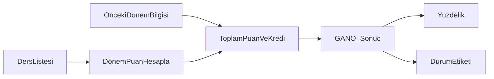

# Kredi Hesaplama (GANO-DANO)

> Türkiye'deki üniversite öğrencileri için tarayıcı tabanlı, kurulumsuz ağırlıklı not ortalaması hesaplayıcı.

[](https://developer.mozilla.org/en-US/docs/Web/HTML)
[](https://developer.mozilla.org/en-US/docs/Web/JavaScript)
[](https://tailwindcss.com)
[](https://github.com/dogukannparlak/Kredi-Hesaplama-GANO-DANO)

**[GitHub Repo](https://github.com/dogukannparlak/Kredi-Hesaplama-GANO-DANO)** · Tek dosya · Kurulum yok · Veri sunucuya gitmez

---

## Hakkında

Üniversite döneminde dönem sonu not ortalamamı hızlıca hesaplamak, önceki dönemlerle birleştirip **GANO**'yu görmek ve Excel'den ders listesi aktarmak için yazdığım kişisel bir side-project.

Karmaşık bir altyapı yerine bilinçli olarak **tek HTML dosyası** tercih ettim: indir, tarayıcıda aç, kullan. Fork'layıp kendi üniversitenin not sistemine göre uyarlamak da kolay.

> **Not:** Bu uygulama resmi bir üniversite aracı değildir. Kişisel hesaplama ve pratik kullanım amaçlıdır; resmi transkript veya kayıt işlemleri için kurumunuzun sistemlerini kullanın.

---

## Önizleme

Ekran görüntüsü henüz eklenmedi — proje Dracula temalı koyu arayüz, mor vurgular ve mobil uyumlu düzenle çalışır.

Arayüzde görecekleriniz:
- Önceki dönem kredi / ortalama girişi
- Not sistemi seçici (4 farklı skala)
- Ders satırları ve dosyadan içe aktarma
- GANO, yüzdelik karşılık ve durum etiketi sonuç kartları

---

## Özellikler

### Çalışan özellikler

- **4 farklı not sistemi** — Türkiye'deki yaygın harf notu skalaları
- **GANO hesaplama** — önceki dönem kredi ve ortalamasını dahil ederek genel ağırlıklı not ortalaması
- **Dosyadan veri yükleme** — Excel (`.xlsx`, `.xls`) ve virgülle ayrılmış `.txt` dosyaları
- **Yüzdelik karşılık** — GPA'nin 4.00 üzerinden yüzdeye çevrilmesi
- **Durum değerlendirmesi** — Çok Başarılı'dan Kritik Durum'a kadar etiketler
- **Dracula temalı arayüz** — koyu palet, responsive tasarım, yumuşak animasyonlar
- **Tamamen istemci tarafı** — notlarınız sunucuya gönderilmez

### Bilmeniz gerekenler

| Konu | Durum |
|------|-------|
| **GANO** | Ayrı sonuç kutusunda gösterilir |
| **DANO** | Ayrı sonuç kutusu yok. Önceki dönem kredi ve ortalamayı `0` girerseniz elde ettiğiniz değer fiilen dönem ortalamasıdır; sonuç yine **GANO** etiketiyle gösterilir |
| **Dönem ders sayısı** | Arayüzde dropdown var; satır otomatik doldurma şu an **aktif değil** |

---

## Hızlı Başlangıç

```bash
git clone https://github.com/dogukannparlak/Kredi-Hesaplama-GANO-DANO.git
cd Kredi-Hesaplama-GANO-DANO
```

Ardından `index.html` dosyasını tarayıcınızda açın — çift tıklama veya VS Code Live Server yeterli.

**Gereksinimler:**
- Modern bir tarayıcı (Chrome, Firefox, Safari, Edge)
- İnternet bağlantısı (Tailwind CSS, SheetJS, Google Fonts CDN üzerinden yüklenir)

**Gerekmeyenler:**
- Node.js, npm, Python veya herhangi bir build adımı

---

## Kullanım

### 1. Not sisteminizi seçin

Üniversitenizin kullandığı harf notu skalasını **Not Sistemi Seçin** alanından belirleyin.

### 2. Önceki dönem bilgilerini girin

| Alan | Açıklama |
|------|----------|
| Mevcut Toplam Kredi | Önceki tüm dönemlerin toplam kredi sayısı |
| Mevcut Ortalama | Önceki dönemlerin genel not ortalaması (0.00–4.00) |

Sadece bu dönemi hesaplamak istiyorsanız her iki alanı da `0` bırakın.

### 3. Derslerinizi ekleyin

- **Ders Ekle** ile satır ekleyin
- Her satır için ders adı (isteğe bağlı), harf notu ve kredi girin
- Veya **Dosya Seç** ile Excel / metin dosyası yükleyin

### 4. Hesaplayın

**Hesapla** butonuna basın. Sonuç alanında GANO, yüzdelik karşılık, durum etiketi ve ders bazlı detay listesi görünür.

---

## Dosya İçe Aktarma

### Metin dosyası (`.txt`)

Her satır virgülle ayrılmış üç alan içermelidir:

```
Ders Adı,HarfNotu,Kredi
Matematik I,AA,6
Fizik I,BA,5
Algoritma ve Programlama,BB,4
```

### Excel dosyası (`.xlsx`, `.xls`)

İlk sayfadaki sütunlar aynı sırayla okunur: ders adı, harf notu, kredi.

### Örnek veri uyarısı

Repodaki `notlar.txt` kişisel ders kayıtlarımı içerir. Bazı satırlarda `D1` notu geçer; **Sistem 4**'te yalnızca `D` ve `F` tanımlıdır. Bu dosyayı Sistem 4 ile kullanırken notları uyumlu harflere çevirmeniz gerekir.

Doğru Sistem 4 örneği:

```
Veri Yapıları,B2,4
Nesneye Yönelik Programlama,BA,4
Elektroteknik,D,4
```

---

## GANO Nasıl Hesaplanır?

```
Dönem puanı = Σ (harf_puanı × kredi)
GANO        = (dönem_puanı + önceki_kredi × önceki_ortalama) / (dönem_kredisi + önceki_kredi)
Yüzdelik    = (GANO / 4.00) × 100
```

Başarısız notlar (`F`, `FF`, `FD`) ortalamaya **0 puan** ile dahil edilir — kredi yine sayılır.



### Durum eşikleri

| GANO | Durum |
|------|-------|
| ≥ 3.50 | Çok Başarılı |
| ≥ 3.00 | Başarılı |
| ≥ 2.50 | Orta Düzey |
| ≥ 2.00 | Geliştirilmeli |
| < 2.00 | Kritik Durum |

---

## Not Sistemleri

### Sistem 1

| Harf | Puan | Harf | Puan | Harf | Puan |
|------|------|------|------|------|------|
| AA | 4.00 | BB | 3.00 | DD | 1.00 |
| BA | 3.50 | CB | 2.50 | FD | 0.50 |
| | | CC | 2.00 | FF | 0.00 |
| | | DC | 1.50 | | |

### Sistem 2

| Harf | Puan | Harf | Puan | Harf | Puan |
|------|------|------|------|------|------|
| AA | 4.00 | BB | 3.25 | CC | 2.50 |
| AB | 3.75 | BC | 3.00 | CD | 2.25 |
| BA | 3.50 | CB | 2.75 | DC | 2.00 |
| | | | | DD | 1.75 |
| | | | | FF | 0.00 |

### Sistem 3

| Harf | Puan | Harf | Puan | Harf | Puan |
|------|------|------|------|------|------|
| A | 4.00 | B | 3.00 | C | 2.00 |
| A- | 3.70 | B- | 2.70 | C- | 1.70 |
| B+ | 3.30 | C+ | 2.30 | D+ | 1.30 |
| | | | | D | 1.00 |
| | | | | D- | 0.70 |
| | | | | F | 0.00 |

### Sistem 4

| Harf | Puan | Harf | Puan | Harf | Puan |
|------|------|------|------|------|------|
| A1 | 4.00 | B1 | 3.25 | C1 | 2.50 |
| A2 | 3.75 | B2 | 3.00 | C2 | 2.25 |
| A3 | 3.50 | B3 | 2.75 | C3 | 2.00 |
| | | | | D | 1.75 |
| | | | | F | 0.00 |

---

## Kullanım Örnekleri

### Yeni öğrenci (sadece bu dönem)

```
Önceki Dönem Kredi: 0
Önceki Dönem Ortalama: 0

Dersler:
- Matematik I      (AA, 6 kredi)
- Fizik I          (BA, 5 kredi)
- Kimya I          (BB, 4 kredi)
- Türk Dili I      (AA, 2 kredi)
- Atatürk İlkeleri (BA, 2 kredi)
- Programlama      (AA, 4 kredi)
```

### Devam eden öğrenci (GANO)

```
Önceki Dönem Kredi: 45.5
Önceki Dönem Ortalama: 2.85

Bu dönem dersleri:
- Veri Yapıları              (BB, 4 kredi)
- Nesneye Yönelik Prog.     (BA, 4 kredi)
- Elektroteknik              (CB, 4 kredi)
- Sayısal Devreler           (CC, 4 kredi)
- Proje Yönetimi             (BA, 5 kredi)
```

---

## Dosya Yapısı

```
Kredi-Hesaplama-GANO-DANO/
├── index.html      # Tüm uygulama (UI + hesaplama mantığı)
├── notlar.txt      # Örnek ders verisi
└── README.md       # Bu dosya
```

---

## Teknik Detaylar

| Katman | Teknoloji |
|--------|-----------|
| Yapı | HTML5, CSS3, JavaScript (ES6+) |
| Stil | Tailwind CSS (CDN) |
| Font | Inter (Google Fonts) |
| Excel okuma | SheetJS / xlsx 0.18.5 (CDN) |
| Build | Yok — statik dosya |

### CDN bağımlılıkları

- `https://cdn.tailwindcss.com`
- `https://cdnjs.cloudflare.com/ajax/libs/xlsx/0.18.5/xlsx.full.min.js`
- `https://fonts.googleapis.com/css2?family=Inter`

### Tarayıcı desteği

- Chrome 80+
- Firefox 75+
- Safari 13+
- Edge 80+

### Gizlilik

Tüm hesaplamalar tarayıcınızda yapılır. Ders notları veya kişisel veriler herhangi bir sunucuya iletilmez.

---

## Özelleştirme

### Yeni not sistemi ekleme

`index.html` içindeki `notSistemleri` objesine yeni bir sistem ekleyin:

```javascript
const notSistemleri = {
    // Mevcut sistemler...
    sistem5: {
        harfler: ['A+', 'A', 'A-', 'B+', 'B', 'B-', 'C+', 'C', 'C-', 'D', 'F'],
        puanlar: {
            'A+': 4.00, 'A': 3.75, 'A-': 3.50, 'B+': 3.25,
            'B': 3.00, 'B-': 2.75, 'C+': 2.50, 'C': 2.25,
            'C-': 2.00, 'D': 1.00, 'F': 0.00
        }
    }
};
```

Ardından `<select id="not-sistemi">` içine yeni seçeneği eklemeyi unutmayın.

### Tema özelleştirmesi

Dracula renk paleti CSS değişkenleriyle tanımlıdır:

```css
:root {
    --dracula-bg: #282a36;
    --dracula-foreground: #f8f8f2;
    --dracula-purple: #bd93f9;
    --dracula-green: #50fa7b;
    /* ... */
}
```

---

## Yol Haritası

Gelecekte eklemek istediğim şeyler:

- [ ] Ayrı **DANO** sonuç kutusu (dönem ortalaması GANO'dan bağımsız gösterilsin)
- [ ] Dönem ders sayısı dropdown'ının satır otomatik doldurma ile entegrasyonu
- [ ] MIT `LICENSE` dosyası
- [ ] GitHub Pages üzerinde canlı demo
- [ ] Sistem 4'e `D1` desteği veya `notlar.txt` örnek verisinin güncellenmesi
- [ ] Arayüz ekran görüntüsü

Küçük iyileştirmeler, bug fix'ler ve yeni not sistemi katkılarına açığım.

---

## Katkıda Bulunma

1. Repoyu fork edin
2. Yeni bir dal oluşturun (`git checkout -b ozellik/yeni-not-sistemi`)
3. Değişikliklerinizi commit edin
4. Dalınızı push edip Pull Request açın

Hata bildirimi, özellik önerisi veya sorular için [Issues](https://github.com/dogukannparlak/Kredi-Hesaplama-GANO-DANO/issues) sekmesini kullanabilirsiniz.

---

## Yazar

**Doğukan Parlak**

- GitHub: [@dogukannparlak](https://github.com/dogukannparlak)
- Instagram: [@dogukanparlak_](https://instagram.com/dogukanparlak_)

Bu projeyi kendi ihtiyacım için yazdım; başka öğrencilere de faydalı olursa sevinirim. Fork'layıp geliştirmek tamamen serbest — geri bildirimlerinizi bekliyorum.

---

## Lisans

Bu proje açık kaynak olarak paylaşılmaktadır. Henüz ayrı bir lisans dosyası eklenmemiştir; kullanım ve katkı koşulları hakkında sorularınız için issue açabilirsiniz.

---

*Türkiye'deki üniversite öğrencileri için, Türk yükseköğretim not sistemlerine göre tasarlanmıştır.*
