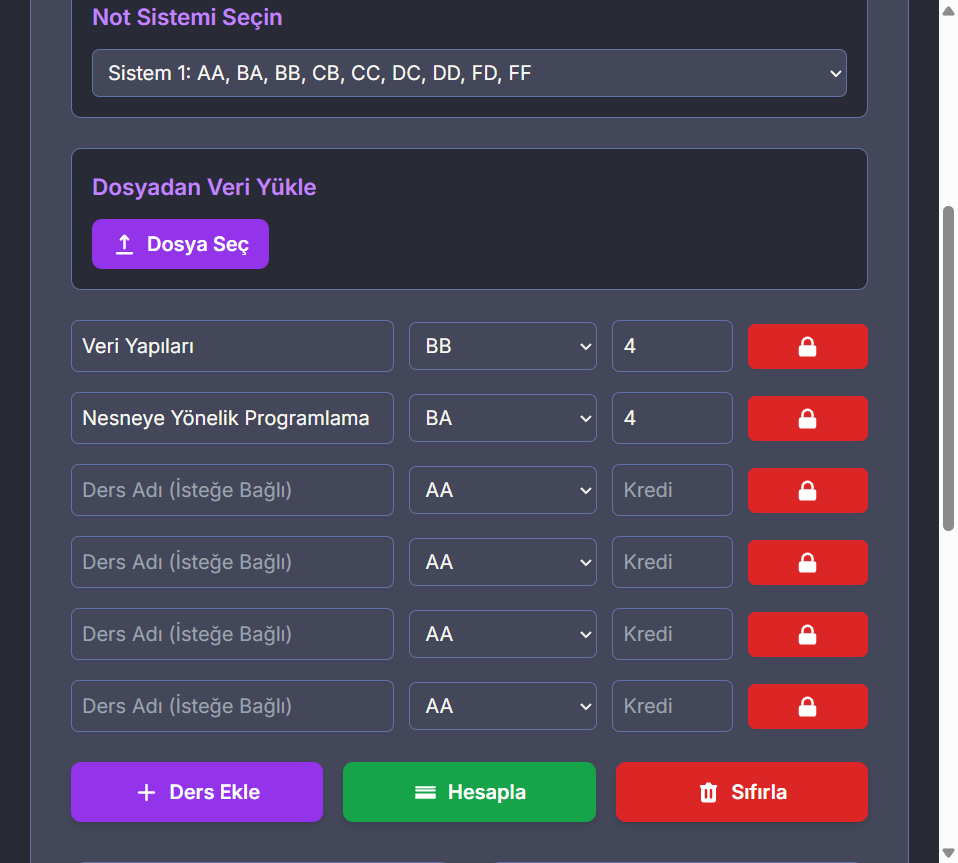
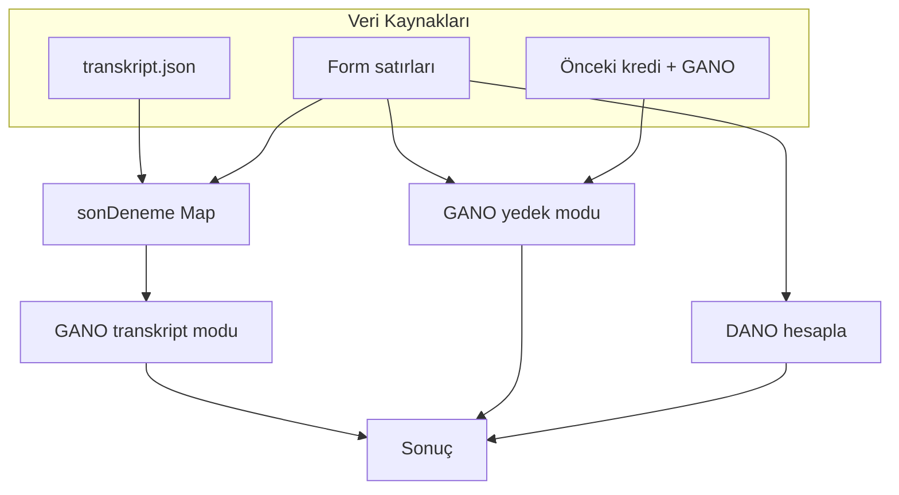

# Kredi Hesaplama (GANO-DANO)

> Türkiye'deki üniversite öğrencileri için tarayıcı tabanlı, kurulumsuz ağırlıklı not ortalaması hesaplayıcı.

[](https://developer.mozilla.org/en-US/docs/Web/HTML)
[](https://developer.mozilla.org/en-US/docs/Web/JavaScript)
[](https://tailwindcss.com)
[](LICENSE)
[](https://gano-dano.dogukanparlak.com/)

**[Canlı Demo](https://gano-dano.dogukanparlak.com/)** · **[GitHub Repo](https://github.com/dogukannparlak/Kredi-Hesaplama-GANO-DANO)** · Kurulum yok · Veri sunucuya gitmez

---

## Hakkında

Üniversite döneminde **DANO** (dönem ortalaması) ve **GANO** (genel ortalama) hesaplamak, önceki dönemleri dahil etmek ve Excel'den ders listesi aktarmak için yazdığım kişisel bir side-project.

Karmaşık bir altyapı yerine bilinçli olarak **tek HTML dosyası** tercih ettim: indir, tarayıcıda aç, kullan. Fork'layıp kendi üniversitenin not sistemine göre uyarlamak da kolay.

> **Not:** Bu uygulama resmi bir üniversite aracı değildir. Kişisel hesaplama ve pratik kullanım amaçlıdır; resmi transkript veya kayıt işlemleri için kurumunuzun sistemlerini kullanın.

---

## Canlı Kullanım

Projeyi hemen denemek için:

**https://gano-dano.dogukanparlak.com/**

Alternatif adres (GitHub Pages): https://dogukannparlak.github.io/Kredi-Hesaplama-GANO-DANO/

---

## Önizleme



Dracula temalı koyu arayüz, mor ve cyan vurgular, mobil uyumlu düzen. Sonuç alanında **DANO**, **GANO**, yüzdelik karşılık ve durum etiketi birlikte gösterilir.

---

## Özellikler

| Özellik | Açıklama |
|---------|----------|
| **DANO** | Yalnızca bu dönemin (form) dersleriyle dönem ağırlıklı not ortalaması |
| **GANO (transkript)** | JSON geçmiş + form birleşimi; ders kodu bazında **son deneme** |
| **GANO (yedek mod)** | Transkript yoksa önceki kredi × önceki ortalama ile klasik formül |
| **Transkript JSON** | Tüm dönem geçmişini içe aktarma; `localStorage` ile kalıcı |
| **Tekrar ders ipucu** | Ders kodu geçmişte varsa önceki not ve dönem gösterilir |
| **4 not sistemi** | Türkiye'deki yaygın harf notu skalaları (Sistem 1–4) |
| **Dönem ders sayısı** | Dropdown ile satır sayısını otomatik ayarlama |
| **Dosya import** | JSON, Excel (`.xlsx`, `.xls`) ve CSV benzeri `.txt` |
| **Yüzdelik karşılık** | GANO'nun 4.00 üzerinden yüzdeye çevrilmesi |
| **Durum etiketi** | Çok Başarılı → Kritik Durum (GANO bazlı) |
| **Gizlilik** | Tüm hesaplamalar tarayıcıda; veri sunucuya gitmez |

---

## Hızlı Başlangıç

### Seçenek 1: Canlı demo (önerilen)

Tarayıcıda aç: **[gano-dano.dogukanparlak.com](https://gano-dano.dogukanparlak.com/)**

### Seçenek 2: Yerel kullanım

```bash
git clone https://github.com/dogukannparlak/Kredi-Hesaplama-GANO-DANO.git
cd Kredi-Hesaplama-GANO-DANO
```

Ardından `index.html` dosyasını tarayıcınızda açın.

**Gereksinimler:** Modern tarayıcı + internet (CDN kaynakları için)

**Gerekmeyenler:** Node.js, npm, build adımı

---

## Kullanım

### 1. Not sisteminizi seçin

Üniversitenizin harf notu skalasını **Not Sistemi Seçin** alanından belirleyin.

### 2. Transkript yükleyin (önerilen, GANO için)

**Transkript (.json)** butonu ile geçmiş dönemlerinizi içe aktarın. Format için [`transkript-ornek.json`](transkript-ornek.json) dosyasına bakın. Yükleme sonrası:

- Sistem 4 otomatik seçilir (ADÜ transkripti)
- GANO, ders kodu bazında son deneme ile hesaplanır
- Transkript `localStorage`'a kaydedilir (sayfa yenilenince korunur)
- **Transkripti Temizle** ile sıfırlanabilir

Transkript yüklüyken **Yedek mod** alanları soluk görünür; değerler silinmez.

### 3. Önceki dönem bilgileri (yedek mod)

Transkript yoksa GANO için önceki dönem bilgilerini girin:

| Alan | Açıklama |
|------|----------|
| Mevcut Toplam Kredi | Önceki tüm dönemlerin toplam kredi sayısı |
| Mevcut GANO | Önceki dönemlerin genel not ortalaması (0.00–4.00) |

Sadece bu dönemi hesaplamak istiyorsanız her iki alanı da `0` bırakın.

### 4. Derslerinizi ekleyin

- **Dönem Ders Sayısı** dropdown'ından kaç ders aldığınızı seçin (satırlar otomatik oluşur)
- **Ders Ekle** ile ek satır ekleyin
- Her satır için **ders kodu** (GANO için önerilir), ders adı, harf notu ve kredi girin
- Aynı kod geçmişte varsa satır altında *Önceki: F1 (24/25 Güz)* ipucu görünür
- Veya **Ders Listesi (.txt / .xlsx)** ile dosya yükleyin

### 5. Hesaplayın

**Hesapla** butonuna basın. Sonuç alanında şunlar görünür:

- **DANO**: dönem ortalamanız (yalnızca form satırları)
- **GANO**: genel ortalamanız (hesaplama modu alt satırda gösterilir)
- **GANO Yüzdelik**: yüzde karşılık
- **Durum**: akademik durum etiketi
- **Detay listesi**: ders bazlı hesaplama özeti; tekrar edilen kodlar vurgulanır

---

## Dosya İçe Aktarma

### Transkript JSON (`.json`)

Dönem bazlı geçmiş kayıtları içe aktarır. Örnek yapı:

```json
[
  {
    "dönem": "25/26 Güz",
    "dersler": [
      { "ders": "Sayısal Devreler", "kod": "CSE211", "tür": "Z", "not": "D1", "akts": 4 }
    ],
    "dano": 1.38,
    "gano": 2.31
  }
]
```

- Hazırlık (HZ) dönemleri GANO hesabına dahil edilmez
- `M`, `G`, `S`, `Ç`, `K` notları hesaba katılmaz
- Tam örnek: [`transkript-ornek.json`](transkript-ornek.json)

### Metin dosyası (`.txt`)

**Yeni format** (kod sütunu ile, GANO için önerilir):

```
Kod,Ders Adı,Not,Kredi
CSE211,Sayısal Devreler,D1,4
MAT153,Matematik I,F1,6
```

**Eski format** (geriye uyumlu):

```
Ders Adı,HarfNotu,Kredi
Matematik I,AA,6
Fizik I,BA,5
```

Kod sütunu yoksa GANO yedek moda düşer. Boş satırlar ve başlık satırı otomatik atlanır.

### Excel dosyası (`.xlsx`, `.xls`)

İlk sayfadaki sütunlar okunur: `Kod`, `Ders Adı`, `Not`, `Kredi` (veya eşdeğer başlıklar). Kod sütunu opsiyoneldir.

### Örnek veri

Repodaki [`notlar.txt`](notlar.txt) kişisel ders kayıtlarımı içerir ve **Sistem 4** notlarıyla uyumludur (`D1`, `F1` dahil). Dosyayı yüklerken not sistemini Sistem 4 olarak seçin.

---

## GANO ve DANO Nasıl Hesaplanır?

### DANO (dönem ortalaması)

```
Dönem puanı = Σ (harf_puanı × kredi)   // yalnızca form satırları
DANO        = dönem_puanı / dönem_kredisi
```

### GANO: iki mod

**1. Transkript + form (son deneme)**: transkript JSON yüklüyken:

```
Her ders kodu için en son kayıt alınır (form satırları geçmişi geçersiz kılar)
GANO = Σ (son_deneme_puanı × akts) / Σ akts
```

**2. Manuel yedek mod**: transkript yokken:

```
GANO = (dönem_puanı + önceki_kredi × önceki_gano) / (dönem_kredisi + önceki_kredi)
```

```
Yüzdelik = (GANO / 4.00) × 100
```

Başarısız notlar (`F`, `FF`, `FD`, `F1`, `F2`) ortalamaya **0 puan** ile dahil edilir; kredi yine sayılır.

> **Doğruluk notu:** Son-deneme GANO, resmi OBS değerine genelde ±0,03 içinde kalır. Kalan fark, üniversitenin tamamlanan AKTS ve tekrar ders kurallarından kaynaklanabilir.



### Durum eşikleri (GANO)

| GANO | Durum |
|------|-------|
| ≥ 3.50 | Çok Başarılı |
| ≥ 3.00 | Başarılı |
| ≥ 2.50 | Orta Düzey |
| ≥ 2.00 | Geliştirilmeli |
| < 2.00 | Kritik Durum |

---

## Not Sistemleri

### Sistem 1: AA … FF

| Harf | Puan | Harf | Puan | Harf | Puan |
|------|------|------|------|------|------|
| AA | 4.00 | BB | 3.00 | DD | 1.00 |
| BA | 3.50 | CB | 2.50 | FD | 0.50 |
| | | CC | 2.00 | FF | 0.00 |
| | | DC | 1.50 | | |

### Sistem 2: AA, AB, BA … FF

| Harf | Puan | Harf | Puan | Harf | Puan |
|------|------|------|------|------|------|
| AA | 4.00 | BB | 3.25 | CC | 2.50 |
| AB | 3.75 | BC | 3.00 | CD | 2.25 |
| BA | 3.50 | CB | 2.75 | DC | 2.00 |
| | | | | DD | 1.75 |
| | | | | FF | 0.00 |

### Sistem 3: A, A-, B+ … F

| Harf | Puan | Harf | Puan | Harf | Puan |
|------|------|------|------|------|------|
| A | 4.00 | B | 3.00 | C | 2.00 |
| A- | 3.70 | B- | 2.70 | C- | 1.70 |
| B+ | 3.30 | C+ | 2.30 | D+ | 1.30 |
| | | | | D | 1.00 |
| | | | | D- | 0.70 |
| | | | | F | 0.00 |

### Sistem 4: A1, A2, A3 … F

| Harf | Puan | Harf | Puan | Harf | Puan |
|------|------|------|------|------|------|
| A1 | 4.00 | B1 | 3.25 | C1 | 2.50 |
| A2 | 3.75 | B2 | 3.00 | C2 | 2.25 |
| A3 | 3.50 | B3 | 2.75 | C3 | 2.00 |
| | | | | D1 | 1.75 |
| | | | | D | 1.75 |
| | | | | F1 | 0.00 |
| | | | | F2 | 0.00 |
| | | | | F | 0.00 |

---

## Kullanım Örnekleri

### Yeni öğrenci (sadece DANO)

```
Önceki Dönem Kredi: 0
Önceki Dönem Ortalama: 0

Dersler (Sistem 1):
- Matematik I      (AA, 6 kredi)
- Fizik I          (BA, 5 kredi)
- Kimya I          (BB, 4 kredi)
- Türk Dili I      (AA, 2 kredi)
- Atatürk İlkeleri (BA, 2 kredi)
- Programlama      (AA, 4 kredi)

Beklenen sonuç: DANO ≈ 3.59 · GANO = DANO
```

### Transkript JSON ile (DANO + GANO)

```
1. transkript-ornek.json dosyasını Transkript (.json) ile yükle
2. Bu dönem derslerini forma gir (kod + not + kredi)
3. Hesapla

Beklenen (örnek transkript):
- 25/26 Güz DANO: 1,38
- GANO (son deneme): ~2,28 (resmi OBS: 2,31)
```

### Yedek mod (transkript yok)

```
Önceki Dönem Kredi: 98
Önceki Dönem GANO: 2,23

Bu dönem dersleri (Sistem 4, kod ile):
- CSE211  Sayısal Devreler     (D1, 4 kredi)
- MAT153  Matematik I          (F1, 6 kredi)
...

GANO = (dönem_puanı + 98 × 2,23) / (dönem_kredisi + 98)
```

---

## Dosya Yapısı

```
Kredi-Hesaplama-GANO-DANO/
├── index.html                  # Tüm uygulama (UI + hesaplama mantığı)
├── transkript-ornek.json       # Örnek transkript JSON (GANO doğrulama)
├── notlar.txt                  # Örnek ders verisi (Sistem 4)
├── docs/
│   └── screenshot.png          # Arayüz ekran görüntüsü
├── .github/workflows/
│   └── deploy-pages.yml        # GitHub Pages otomatik dağıtım
├── LICENSE                     # MIT lisansı
└── README.md                   # Bu dosya
```

---

## Teknik Detaylar

| Katman | Teknoloji |
|--------|-----------|
| Yapı | HTML5, CSS3, JavaScript (ES6+) |
| Stil | Tailwind CSS (CDN) |
| Font | Inter (Google Fonts) |
| Excel okuma | SheetJS / xlsx 0.18.5 (CDN) |
| Build | Yok, statik dosya |

### CDN bağımlılıkları

- `https://cdn.tailwindcss.com`
- `https://cdnjs.cloudflare.com/ajax/libs/xlsx/0.18.5/xlsx.full.min.js`
- `https://fonts.googleapis.com/css2?family=Inter`

### Tarayıcı desteği

Chrome 80+ · Firefox 75+ · Safari 13+ · Edge 80+

### Dağıtım

| Adres | Açıklama |
|-------|----------|
| [gano-dano.dogukanparlak.com](https://gano-dano.dogukanparlak.com/) | Birincil canlı demo |
| [dogukannparlak.github.io/...](https://dogukannparlak.github.io/Kredi-Hesaplama-GANO-DANO/) | GitHub Pages alternatifi |

`main` veya `master` dalına push yapıldığında [`.github/workflows/deploy-pages.yml`](.github/workflows/deploy-pages.yml) otomatik dağıtım tetikler.

### Gizlilik

Tüm hesaplamalar tarayıcınızda yapılır. Ders notları veya kişisel veriler herhangi bir sunucuya iletilmez. Transkript JSON yalnızca tarayıcınızın `localStorage` alanına kaydedilir.

---

## Özelleştirme

### Yeni not sistemi ekleme

`index.html` içindeki `notSistemleri` objesine yeni bir sistem ekleyin:

```javascript
const notSistemleri = {
    // Mevcut sistemler...
    sistem5: {
        harfler: ['A+', 'A', 'A-', 'B+', 'B', 'B-', 'C+', 'C', 'C-', 'D', 'F'],
        puanlar: {
            'A+': 4.00, 'A': 3.75, 'A-': 3.50, 'B+': 3.25,
            'B': 3.00, 'B-': 2.75, 'C+': 2.50, 'C': 2.25,
            'C-': 2.00, 'D': 1.00, 'F': 0.00
        }
    }
};
```

Ardından `<select id="not-sistemi">` içine yeni seçeneği eklemeyi unutmayın.

### Tema özelleştirmesi

Dracula renk paleti CSS değişkenleriyle tanımlıdır:

```css
:root {
    --dracula-bg: #282a36;
    --dracula-foreground: #f8f8f2;
    --dracula-purple: #bd93f9;
    --dracula-cyan: #8be9fd;
    --dracula-green: #50fa7b;
}
```

---

## Katkıda Bulunma

1. Repoyu fork edin
2. Yeni bir dal oluşturun (`git checkout -b ozellik/yeni-not-sistemi`)
3. Değişikliklerinizi commit edin
4. Dalınızı push edip Pull Request açın

Hata bildirimi ve özellik önerileri için [Issues](https://github.com/dogukannparlak/Kredi-Hesaplama-GANO-DANO/issues) sekmesini kullanabilirsiniz.

---

## Yazar

**Doğukan Parlak**

- Web: [gano-dano.dogukanparlak.com](https://gano-dano.dogukanparlak.com/)
- GitHub: [@dogukannparlak](https://github.com/dogukannparlak)
- Instagram: [@dogukanparlak_](https://instagram.com/dogukanparlak_)

Bu projeyi kendi ihtiyacım için yazdım; başka öğrencilere de faydalı olursa sevinirim. Fork'layıp geliştirmek tamamen serbest.

---

## Lisans

Bu proje [MIT Lisansı](LICENSE) altında lisanslanmıştır.

---

*Türkiye'deki üniversite öğrencileri için, Türk yükseköğretim not sistemlerine göre tasarlanmıştır.*
